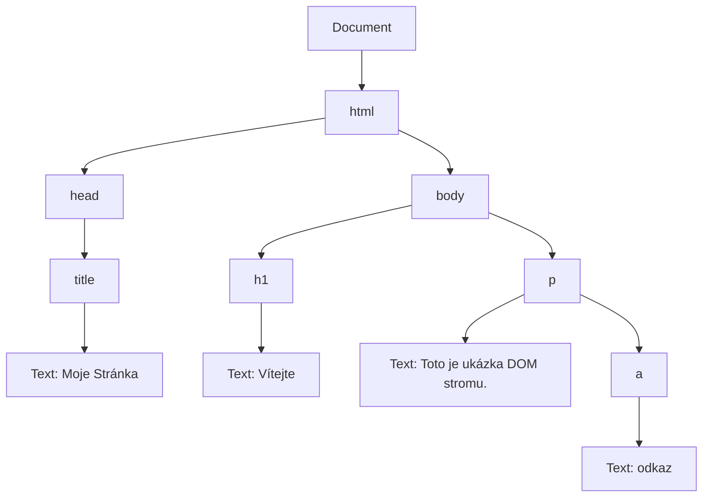

# 27. Práce s DOM

> [!question] Práce s DOM
> Document Object Model (DOM), jeho význam a struktura. Stromová reprezentace HTML dokumentu, uzly a jejich typy. Přístup k prvkům pomocí různých metod, práce s kolekcemi prvků a cykly. Vytváření nových elementů a jejich vkládání do stránky různými způsoby (append, prepend, before, after, appendChild aj.). Odstraňování prvků (removeChild, remove a další). Úprava obsahu prvků – innerHTML, innerText, textContent a jiné. Práce s atributy obecně – získávání, nastavování, mazání, práce s datovými atributy. Traversování mezi elementy – rodiče, děti, sourozenci, počítání potomků a další způsoby pohybu ve stromu dokumentu. Propojení DOM s událostmi a dynamické úpravy obsahu stránky.

---

## Co je to DOM?

**Document Object Model (DOM)** je programové rozhraní (API) pro HTML a XML dokumenty. Prohlížeč po načtení stránky vytvoří objektovou reprezentaci dokumentu ve formě **stromu** (DOM Tree). Každá část stránky (značka, text, komentář) je v tomto stromu reprezentována jako **uzel (node)**.



### Typy uzlů
- **Element Node:** HTML značky (např. `<div>`, `<h1>`).
- **Text Node:** Samotný text uvnitř značek.
- **Comment Node:** HTML komentáře.

---

## Přístup k prvkům (Výběr elementů)

Abychom mohli s prvkem pracovat, musíme ho nejdříve „najít“.

1. **Moderní a univerzální (Doporučeno):**
    - `document.querySelector('.trida')` – Vybere **první** prvek odpovídající CSS selektoru.
    - `document.querySelectorAll('div')` – Vybere **všechny** odpovídající prvky (vrátí NodeList).
2. **Starší metody:**
    - `document.getElementById('id-prvku')`
    - `document.getElementsByClassName('trida')` – Vrátí živou kolekci (HTMLCollection).

---

## Úprava obsahu a atributů

### Obsah
- `element.textContent` – Pouze textový obsah (bezpečné, neparsuje HTML).
- `element.innerHTML` – Vrací/nastavuje obsah včetně HTML značek (pozor na bezpečnost – XSS).

>[!warning] Výkon a bezpečnost
>- Časté manipulace s DOM jsou výpočetně náročné (každá změna může vyvolat překreslení stránky).
>- Při používání `innerHTML` s daty od uživatele hrozí **XSS útoky**. Vždy preferuj `textContent`.

### Atributy
- `element.getAttribute('src')` / `element.setAttribute('src', 'img.png')`
- `element.removeAttribute('disabled')`
- **Data atributy:** `element.dataset.id` (přistupuje k `data-id` v HTML).

---

## Manipulace s elementy (Tvorba a mazání)

>[!pros] Proč pracovat s DOM?
>- Stránka reaguje na uživatele bez nutnosti znovunačítání.
>- Možnost vytvářet komplexní webové aplikace (Single Page Applications).

### Vytváření a vkládání
```javascript
const novyPrvek = document.createElement('li');
novyPrvek.textContent = 'Nová položka';

const seznam = document.querySelector('ul');

seznam.append(novyPrvek);    // Vloží na konec (uvnitř)
seznam.prepend(novyPrvek);   // Vloží na začátek (uvnitř)
seznam.before(novyPrvek);    // Vloží před seznam (vně)
seznam.after(novyPrvek);     // Vloží za seznam (vně)
```

### Odstraňování
- `element.remove()` – Moderní způsob, smaže prvek.
- `rodic.removeChild(dite)` – Starší způsob, vyžaduje odkaz na rodiče.

---

## Traversování (Pohyb ve stromu)

Umožňuje se pohybovat od jednoho prvku k ostatním bez nového vyhledávání.

- **Směrem nahoru:** `element.parentElement` (rodič).
- **Směrem dolů:** `element.children` (seznam dětí), `element.firstElementChild`, `element.lastElementChild`.
- **Do stran:** `element.nextElementSibling` (následující sourozenec), `element.previousElementSibling` (předchozí).

>[!info] NodeList vs. Array
>Výsledek `querySelectorAll` je NodeList. Můžeš nad ním použít cyklus `forEach`, ale pokud chceš metody jako `map` nebo `filter`, musíš ho převést na pole: `[...list]`.

---

## Praktická ukázka: Dynamický seznam

Tento kód najde tlačítko, a po kliknutí vytvoří novou položku v seznamu.

```javascript
const tlacitko = document.querySelector('#add-btn');
const seznam = document.querySelector('#ukoly');

tlacitko.addEventListener('click', () => {
    const li = document.createElement('li');
    li.textContent = 'Nový úkol';
    
    // Přidáme možnost smazání kliknutím na položku
    li.addEventListener('click', () => li.remove());
    
    seznam.append(li);
});
```
