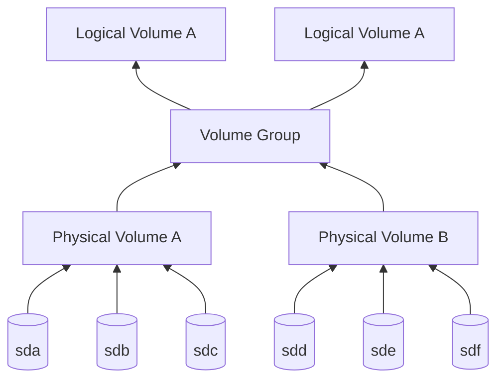

# 23. Svazky (LVM) v systému Linux

>[!warning] Svazky (LVM) v systému Linux
>Pojem svazek, pojmy physical volume, volume group, logical volume, výhody proti běžnému logickému disku, vytvoření svazku, rozšíření svazku, odstranění svazku, svazky a disková pole, konfigurace svazku (pvs, pvcreate, pvremove, pvdisplay, lvs, lvcreate, lvremove, lvdisplay, vgs, vgcreate, vgremove, vgdisplay, vgchange, pvextend, lvextend, resize2fs, lvreduce, vgreduce)

---

## Definice

>[!info] Svazek
>Skupina oddílů nebo disků, jejíž učel je z více menších "uložišť" udělat jedno větší
>
>Anglicky *Volume*

>[!info] Fyzický svazek (Physical volume)
>Svazek oddílů na fyzických discích
>
>"Stavební kámen" pro skupiny svazků

>[!info] Skupina Svazků (Volume Group)
>- Skládá se z fyzických svazků
>- Slouží jako uložiště pro logické svazky

>[!info] Logický svazek (Logical volume)
> - Spravován softwarem
> - Svazek, se kterým pracuje uživatel

---
