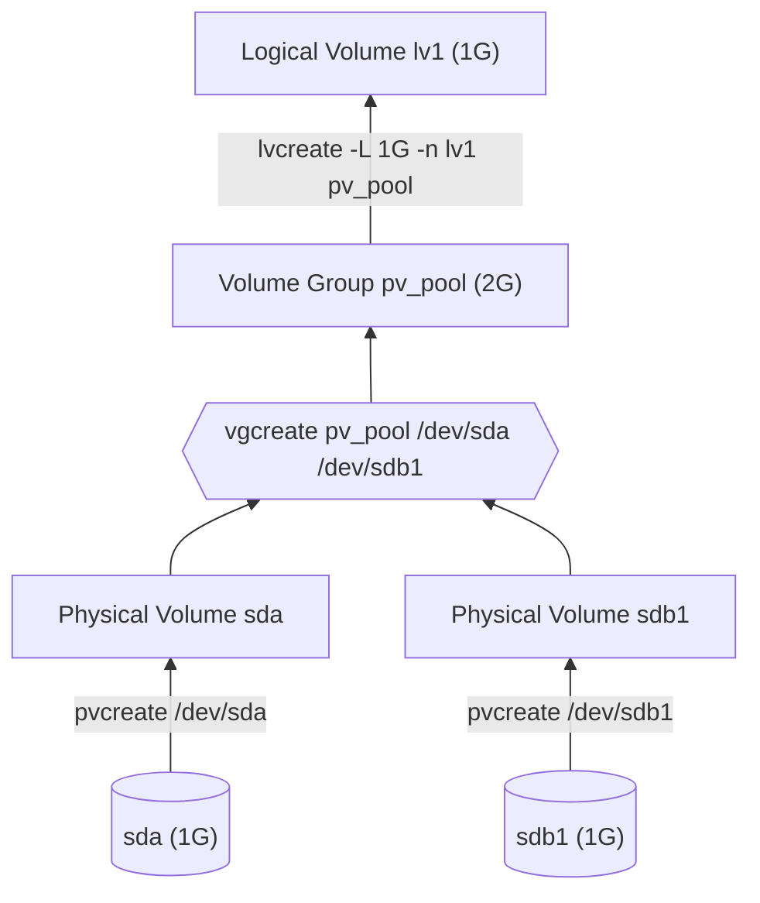

# 23. Svazky (LVM) v systému Linux

>[!warning] Svazky (LVM) v systému Linux
>Pojem svazek, pojmy physical volume, volume group, logical volume, výhody proti běžnému logickému disku, vytvoření svazku, rozšíření svazku, odstranění svazku, svazky a disková pole, konfigurace svazku (pvs, pvcreate, pvremove, pvdisplay, lvs, lvcreate, lvremove, lvdisplay, vgs, vgcreate, vgremove, vgdisplay, vgchange, pvextend, lvextend, resize2fs, lvreduce, vgreduce)

---

## Definice

>[!info] Svazek (Volume)
> Více oddílu nebo disků sjednoceno do jedné skupiny

>[!info] Fyzický svazek (Physical volume)
>- Svazek reprezentující oddíl nebo celý fyzický disk
>- "Stavební kámen" pro skupiny svazků

>[!info] Skupina Svazků (Volume Group)
>- Skládá se z jednoho nebo více fyzických svazků
>- Slouží jako uložiště pro logické svazky

>[!info] Logický svazek (Logical volume)
> - Spravován softwarem
> - Svazek, se kterým pracuje uživatel



---

## Logický svazek vs. běžný disk

Zásadní rozdíl mezi běžný diskem a logickým svazkem je možnost manipulace s logickým svazkem.

Manipulací myslíme dynamické zvětšování/zmenšování a správu fyzických zařízení bez nutnosti mít downtime

---

## Konfigurace

### Zobrazení

Pro zobrazení informací o daném objektu jsou následující příkazy

- **Fyzický svazek** - `pvs`, `pvdisplay` nebo `pvscan`
- **Skupina svazků** - `vgs`, `vgdisplay` nebo `vgscan`
- **Logický svazek** - `lvs`, `lvdisplay` nebo `lvscan`

### Vytvoření

> Pracujeme s diskem `/dev/sda` a oddílem `/dev/sdb1`
#### 1. Fyzický svazek

Fyzický svazek (PV) vytvoříme pomocí příkazu `pvcreate`

```bash
pvcreate /dev/sda /dev/sdb1
```

#### 2. Skupina svazků

Skupina svazků (VG) nám bude sloužit jako uložiště pro logické svazky. Vytvoříme ji pomocí `vg create`

```bash
# Vytvoří se VG s názvem pv_pool
vgcreat pv_pool /dev/sda /dev/sdb1
```

#### 3. Logický svazek

Logický svazek (LV) už je svazek, na kterém se budou ukládat data a přistupuje k němu uživatel. Vytvoříme ho pomocí `lvcreate`

```bash
# Vytvoří se lineární LV s velikostí 1G,
# názvem lv1 a uložištěm v pv_pool
lvcreate -L 1G -n lv1 pv_pool
```

#### 4. Finalizace

Nyní můžeme dát pomocí `mkfs` na LV file system a poté ho můžeme používat

---

### Smazání

Jak bylo u vytváření nejdřív PV a na konci LV, tak teď půjdeme pozpátku a začneme LV a skončíme PV

#### 0. Předpoklad

Je potřeba mít disk odmontován pomocí `umount`

#### 1. LV

```bash
lvremove /dev/pv_pool/lv1
```

#### 2. VG

```bash
vgremove pv_pool
```

#### 3. PV

```bash
pvremove /dev/sda /dev/sdb1
```

---

### `**change`

Každý ze 3 zmíněných objektů má sadu atributu, které se dají upravovat pomocí následujících příkazů

- **PV** - `pvchange`
- **VG** - `vgchange`
- **LV** - `lvchange`

Pomocí parametru `--help` nebo manuálu `man` můžete zjistit možná nastavení

---

### Zvětšní VG nebo LV

Pro zvětšní VG existuje příkaz `vgextend` v následující podobě

```bash
vgextend <název VG> <název PV>

# Chceme zvětší pv_pool o /dev/sdc
vgextend pv_pool /dev/sdc
```

Pro zvětšení LV použijeme `lvextend`

POZOR! Zadaná velikost je výsledna a ne ta, o kterou se kapacita navýší

```bash
lvextend -L <velikost> /dev/<VG>/<LV>

# Zvětším lv1 na 1.2G
lvextend -L 1.2G /dev/pv_pool/lv1
```

---

### Zmenšení VG nebo LV

Pro zmenšení VG existuje příkaz `vgreduce` v následující podobě

```bash
vgreduce <název VG> <název PV>

# Chceme zmenšit pv_pool o /dev/sdc
vgreduce pv_pool /dev/sdc
```

Pro zmenšení LV použijeme `lvreduce`

POZOR! Zadaná velikost je výsledna a ne ta, o kterou se kapacita sníží

```bash
lvreduce -L <velikost> /dev/<VG>/<LV>

# Zmenšíme lv1 na 900M
lvextend -L 900M /dev/pv_pool/lv1
```

---

### Zvětšení FS

Pro zvětšení FS v případě navýšení kapacit LV použijeme příkaz

```bash
resize2fs <cesta k LV> <velikost>

# Změna velikosti na 400M
resize2fs /dev/pv_pool/lvn1 900M
```